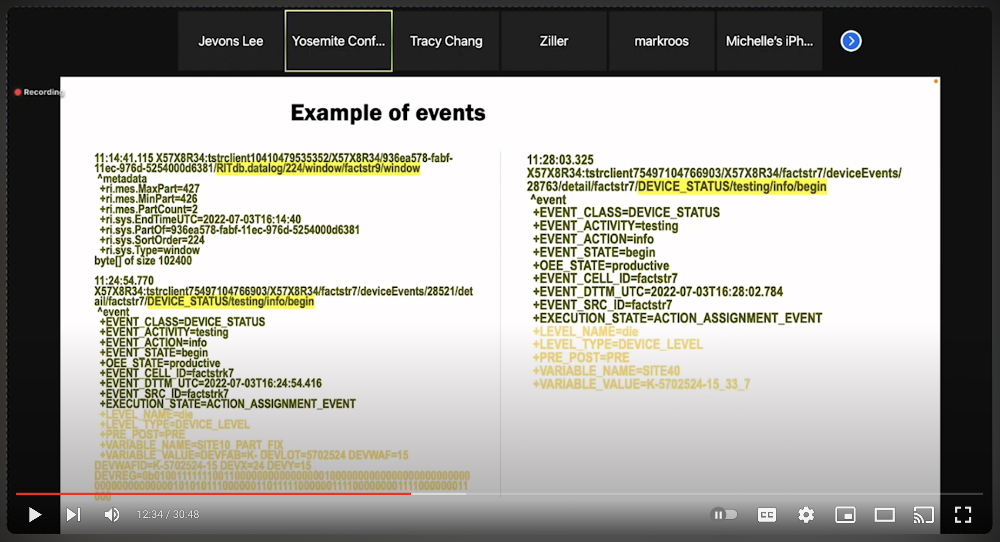

# RitDB Inflight Data Generator

## Scope

- [ ] Find more details on which values of tokens should be used for topics for our use cases (api, domain, etc)
- [x] Generate "synthetic" detailed message bodies
- [x] Generate real detailed messages from ritDB file
- [ ] Generate "synthetic" archive message bodies
- [ ] Generate real archive messages from ritDB file
- [ ] Figure out how window messages should be used
- [ ] Generate window messages
- [ ] Figure out what is the intended scope of the "events" messages (whether they are for lifecycle events or also to send "core" data in a different way)
- [ ] Generate events messages
- [ ] Include entity information into the messages (if applicable)

## References

- RitDB Standard specification, SEMI E183-0123
- [RitDB overview video](https://www.youtube.com/watch?v=gafM2L15zfU)

## Generate detailed messages bodies

### Topic info

Topic should be something like `<reply address>/[hops as required/...]/<domain>/<channel>/<api>/<msgId>/detailed/<source>`

Examples from the [video](#overview-video) show that the source is likely the same as the channel and return address, as they are closely related to each other.

In the upcoming example, a dummy topic name will be used, because it's something we can review later on

### Body

#### Derivation from the [standard](#spec-pdf)

The message body is an ordered map (or "omap") of metadataa and an array of ritDB rows.

An omap is a CBOR array with the following characteristics:
- Element one is tag number 19
- Element two is the name of the ordered map (or CBOR `null`)
- Follow up elements go in pairs, in the form of key-value pairs

#### Open questions/"Best guesses" of the implied part of the spec

**Regarding the structure of the body**

The [spec](#spec-pdf) states that:
> In detail stream types, the message body shall consist of an omap of metadata and an array
representing the rows of a RITdb container.

However CBOR is like JSON, in that normally the root element is "unique". So the message body would need to combine the omap and the data array in a single "piece". The 3 possibilities are a CBOR object, a CBOR array, or a CBOR sequence.

CBOR object seems a bit strange solution since you would need to specify field names, which is not mentioned at all. CBOR sequences is an extension of the spec to send several base CBOR messages "in a row" without a single root, but it's not part of the core spec. Therefore by default I wrapped the 2 parts of the body in an array.

**Regarding encoding of the data**

The spec states that the data is an array of rows. It's unclear from the docs whether this data array is 2 dimensional (1 element per row, which itself is an array of cells), or if you have only 1-dimensional array (since the amount of columns is fixed and known). I made the body as 2-dimensional.

**Regarding encoding of cells**
The spec states:
> In detail stream types, the table cell values shall be encoded as an CBOR indefinite length
array in row major order.

I assumed this to mean that each cell is encoded as the standard CBOR representation of the value it represents, and not "nested" CBOR (the body is a CBOR element and the cells should be encoded in CBOR again before being put in the array).

I also assumed that the cell order is the same as the order of the columns in the ritDB file:
- sequence
- entityID
- indexID
- name
- value
- value2
